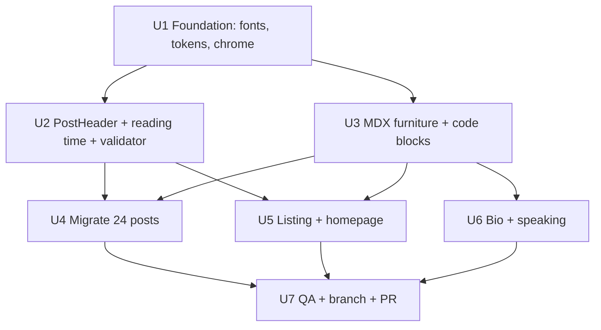

# Editorial Redesign - Plan

## Goal Capsule

- **Objective:** Reskin the entire blog to the approved editorial design (serif prose, tinted neutrals, oxblood accent, quiet furniture) so every page — posts, listing, homepage, bio, speaking — ships the reading experience previewed in the approved mockup.
- **Authority:** This plan's Product Contract governs behaviour; the approved mockup artifact (https://claude.ai/code/artifact/7be8afa4-ac98-4407-a518-942b84c4d960) is the visual reference; exact token values are restated in U1/U3 so the plan is self-sufficient.
- **Stop conditions:** Do not merge to main — work lands on branch `feat/editorial-redesign` with a PR and Vercel preview for Ben's sign-off. Stop and surface if any change would alter SEO metadata output (JSON-LD, sitemap, RSS, canonical URLs) rather than presentation.
- **Execution profile:** Delegated multi-model execution per the Delegation Map; smoke-first verification (build + validate-posts + visual pass), not TDD.

---

## Product Contract

### Summary

Implement the approved editorial redesign site-wide: typography foundation and colour tokens, a new post header rendering the dormant `subtitle` and never-shown dates, restyled MDX furniture and code blocks, mechanical migration of all 24 posts, and bespoke passes on listing, homepage, bio, and speaking pages — executed with per-unit model delegation for cost efficiency.

### Problem Frame

The site's current template (Outfit sans, `leading-snug`, coloured callout boxes, no dates on post pages, no navigation) undersells the writing and reads as a default Tailwind blog. Ben's publishing motivation is tied to how good the artifact looks; the approved mockup demonstrated an Every.to-calibre reading experience. The design decisions are made — this plan turns them into the live template.

### Requirements

**Reading experience**
- R1. Post prose is set in Source Serif 4 at 19px with 1.7 line-height on a ~39rem measure; Outfit is retained for chrome (masthead, labels, footer).
- R2. Colour comes from a token set of cool-tinted paper/ink neutrals plus a single oxblood accent, defined once and honoured in both light and dark themes (no pure `#fff`/`#000`).
- R3. Every post opens with a header showing a date + reading-time kicker, a display-scale serif title, and the italic subtitle already present in all 24 posts' metadata.
- R4. Editorial furniture (Callout, KeyPoint, TLDR, PullQuote, Scenario, Collapsible, blockquote, hr) is restyled as quiet hairline-and-label typography — no coloured boxes, no left-border stripes; hr renders as an asterism.
- R5. Code blocks are redesigned for both themes: paper-tinted with a hairline border in light mode, with sugar-high token colours adjusted per theme; inline code matches.
- R6. Images render as captioned figure plates (hairline border, italic serif caption, optional credit), dimmed slightly in dark mode; a drop cap is available as an opt-in per-post device.

**Site chrome and pages**
- R7. All pages carry a one-line masthead (wordmark + posts/bio/speaking nav) and the restyled footer; a branded `not-found` page replaces the default Next.js 404.
- R8. The posts listing shows serif titles with dates and reading times instead of bare underlined links.
- R9. Homepage, bio (including Timeline/Event), and speaking pages get bespoke restyles in the same system.

**Integrity**
- R10. SEO behaviour is unchanged: metadata exports, PostSchema/JSON-LD, sitemap, RSS, and canonical URLs produce identical output; `scripts/validate-posts.mjs` is extended to guard the new post format.
- R11. The agreed refinements hold: drop cap is opt-in (not automatic), pull quotes must not sit adjacent to their source sentence, and post end-matter runs asterism → TL;DR → credits → related posts.

### Scope Boundaries

**Deferred to Follow-Up Work**
- Scrollytelling/feature-post component for occasional art-directed posts.
- Engagement features from `docs/ideas.md` (newsletter, search, tags, post-to-post nav).
- Custom OG image redesign; heading anchor links (blocked by `mdxRs` — no rehype plugins).
- Housekeeping: remove the `framer-motion` dependency together with `app/demo/magazine/page.tsx` (its only importer) and the leftover `"delete"` npm script.
- Backfill real publication dates for the 11 Substack-imported posts sharing the placeholder date 2023-09-18 — needs Ben's knowledge of the real dates; until then their kickers show the import date, as the listing already does.

**Outside this work**
- No content edits to existing posts: no new TL;DRs or pull quotes are written into old posts; existing `<TLDR>`/`<PullQuote>` usage is restyled only.
- No slug, URL, or information-architecture changes.

---

## Planning Contract

### Key Technical Decisions

- KTD1. **Source Serif 4 (variable, optical sizing + italic) via `next/font/google`, Outfit retained for chrome.** (session-settled: user-approved — chosen over Newsreader-class editorial serifs: approved in the mockup; sturdier match for the site's direct voice and avoids the saturated editorial-serif lane.)
- KTD2. **Design tokens as CSS custom properties in the Tailwind v4 `@theme` block of `app/globals.css`, switched by `prefers-color-scheme` only.** Matches the site's existing system-preference dark mode; no manual toggle is introduced.
- KTD3. **New `PostHeader` component replaces each post's `# Title` line; `PostSchema` stays a separate sibling.** The narrative H1 and the keyword-bearing `metadata.title` are deliberately different values (see `docs/solutions/seo/nextjs-15-comprehensive-seo-improvements.md`), and `experimental.mdxRs` forbids remark/rehype derivation — so the header carries the display title as a prop, resolves date/subtitle/reading time from the `lib/posts.ts` index by slug, and the validator enforces consistency.
- KTD4. **Reading time computed at build inside `lib/posts.ts`** as a `readingMinutes` field on the shared post index, serving both `PostHeader` and the listing; no new dependencies.
- KTD5. **Drop cap ships as an opt-in `Lede` component**, not an automatic `::first-letter` rule — most posts open on glyphs (like "I") that set badly.
- KTD6. **Post migration fans out to cheap models with `validate-posts` + `next build` as guardrails.** (session-settled: user-directed — chosen over doing all work at full tier: Ben asked for efficient delegation of simple work.)
- KTD7. **The default MDX `h1` mapping stays moderate; display scale lives only in `PostHeader`.** Homepage (`# Ben Stewart`) and bio (`# Bio`) H1s must not inflate to post-title scale.
- KTD8. **The underline-link class string duplicated across `app/posts/page.tsx` and `app/speaking/page.tsx` is extracted into a shared component** during U5/U6 rather than edited twice.

### High-Level Technical Design

Token flow: `app/globals.css` `@theme` owns every colour/type token → `app/layout.tsx` wires fonts and chrome → `mdx-components.tsx` and page files consume tokens only (no raw palette classes). The two bespoke client components in `app/posts/ai-made-writing-free/` are the known exception and are re-pointed at tokens in U4.

### Execution Delegation Map

| Unit | Work character | Model | Rationale |
|---|---|---|---|
| U1 | Token/font translation from a fully specified mockup | Sonnet | Values are pinned in this plan; low judgment |
| U2 | New component + script extension, clear contract | Sonnet | Well-specified, moderate care (validator regexes) |
| U3 | Component restyle from pinned treatments | Sonnet, Fable reviews diff | Mostly mechanical; code-block/dark-mode nuance gets a full-tier review |
| U4 | 24-file mechanical migration | Haiku fan-out for 21 uniform posts; Sonnet for the 3 exceptions | Templated edit with hard guardrails; exceptions need judgment |
| U5, U6 | Page restyles in an established system | Sonnet | System exists by then; follow patterns |
| U7 | Visual QA, integration, ship | Fable (orchestrator) | Judgment-heavy; owns the quality gate |

Mechanics: subagents run via the Agent tool with per-call model overrides; U2 and U3 follow U1 and run serially relative to each other (both edit `mdx-components.tsx`); U4's Haiku agents run concurrently with a per-file recipe and must not touch metadata or `PostSchema`; every unit ends with `npm run validate-posts` + `npm run build` before its work is accepted.

---

## Implementation Units

### U1. Design foundation: fonts, tokens, site chrome

- **Goal:** The token system, fonts, masthead, footer, and 404 exist; every later unit consumes them.
- **Requirements:** R1, R2, R7.
- **Dependencies:** none.
- **Files:** `app/layout.tsx`, `app/globals.css`, `app/not-found.tsx` (new).
- **Approach:**
  1. Load Source Serif 4 (`ital,opsz,wght`) and Outfit via `next/font/google`; expose as CSS variables; remove the stale `--font-family-serif: 'STIX Two Text'` line.
  2. Define tokens in `@theme` — light: paper `oklch(97.5% .003 250)`, raised `oklch(99.2% .002 250)`, ink `oklch(24% .012 260)`, muted `oklch(48% .012 260)`, faint `oklch(62% .01 255)`, hairline `oklch(89.5% .005 250)`, accent `oklch(45% .14 20)`; dark: `17.5%/22%/89%/66%/55%/29%` equivalents, accent `oklch(70% .11 25)`; switch via `prefers-color-scheme`.
  3. Rebuild layout chrome: masthead (serif "Ben Stewart" wordmark left; Outfit lowercase posts/bio/speaking right; hairline below), restyled footer, `::selection` in accent, focus-visible ring, a visually-hidden skip-to-content link that becomes visible on focus (WCAG 2.4.1 bypass), and dark-mode `filter: brightness(.88)` on content images. The masthead stays a single row at every width, tightening gaps on mobile (fits the 360px site minimum).
  4. Add `app/not-found.tsx` in the same system (short serif message + link home).
- **Patterns to follow:** Mockup token/typography spec (values above are canonical); existing `layout.tsx` metadata export must be preserved byte-for-byte except className changes (R10).
- **Test scenarios:**
  - Homepage renders with serif available and masthead nav links resolve (`/posts`, `/bio`, `/speaking`).
  - Dark mode via emulated `prefers-color-scheme` shows dark tokens, not pure black.
  - Unknown route renders the branded 404.
  - At 360px width the masthead renders on one row without wrapping or horizontal overflow, and the skip link appears on first Tab press.
- **Verification:** `npm run build` passes; visual check of masthead/footer on `/` in both themes.

### U2. PostHeader, post-index extension, validator update

- **Goal:** Posts render kicker/title/subtitle from one component backed by the shared post index, and the validator enforces the new format.
- **Requirements:** R3, R10.
- **Dependencies:** U1.
- **Files:** `app/components/PostHeader.tsx` (new), `lib/posts.ts`, `lib/posts.test.ts`, `mdx-components.tsx` (register `PostHeader`), `scripts/validate-posts.mjs`.
- **Approach:**
  1. `PostHeader({ title, slug })` renders kicker "9 January 2025 · N min read" (UK date format), display serif h1 (`clamp(2.35rem,6.4vw,3.85rem)`, 1.04 leading, -0.018em, weight 600), and italic subtitle; date, subtitle, and reading time resolve from the `lib/posts.ts` index by slug, so only the display title lives in the prop.
  2. Extend `lib/posts.ts`: display-title extraction prefers a `<PostHeader title="...">` prop over the legacy `# ` H1 (fallback retained so unmigrated posts keep working); add `readingMinutes` (strip metadata/JSX/code fences, `max(1, round(words/230))`); extend `lib/posts.test.ts` with PostHeader-format fixtures via its existing temp-dir pattern.
  3. Update `validate-posts.mjs`: require `<PostHeader` with a non-empty `title` and a `slug` matching the directory; forbid a leading `# ` H1 in the body; keep all existing PostSchema/PostNav checks; harden the body-split (currently naive first-`};` `indexOf`).
- **Patterns to follow:** `lib/posts.ts` `matchQuoted` regex conventions; `lib/posts.test.ts` temp-dir fixture pattern; existing validator's brace-depth metadata extraction.
- **Test scenarios:**
  - Index: a PostHeader-format post yields the prop title (not `metadata.title`); a legacy `# H1` post still parses; `readingMinutes` maps known word counts to expected minutes with a floor of 1.
  - Validator fails a post with a remaining `# Title` line; fails a `PostHeader` slug that doesn't match its directory; passes a correctly migrated post.
  - PostHeader renders the display title, not `metadata.title` (they differ deliberately on `multi-agent-ai-strategy` and `sustainable`).
- **Verification:** `npm test` passes including the extended `lib/posts.test.ts`; validator runs clean against one hand-migrated pilot post (`ralph-isnt-the-point`).

### U3. MDX furniture and code-block restyle

- **Goal:** Every element and custom component in `mdx-components.tsx` renders in the editorial system.
- **Requirements:** R1, R4, R5, R6, R11.
- **Dependencies:** U1.
- **Files:** `mdx-components.tsx`, `app/components/PostNav.tsx`, `app/components/RelatedPosts.tsx`, `app/globals.css`.
- **Approach:**
  1. Element mappings: p 1.1875rem/1.7 serif; h2 1.625rem/600 serif; links ink with accent underline (55% opacity, solid + accent text on hover); blockquote italic inset (no border-left); hr → asterism `* * *` (`aria-hidden` so screen readers skip it); em true italic; strong 620 weight.
  2. Furniture: Callout keeps its four semantic types but renders as hairline-framed typography with a small tracked Outfit label per type; KeyPoint/TLDR as hairline-top + label + serif body; PullQuote centred italic between short rules (no attribution border); Scenario/Collapsible/Timeline/Event and the four `Divider` variants re-token in the same voice; PostNav's prev/next links and its composed RelatedPosts block become quiet "Keep reading" hairline rows (tracked labels, serif titles).
  3. New `Figure({ src, alt, caption, credit, width })` plate component and opt-in `Lede` drop-cap wrapper, both registered in `mdx-components.tsx`; the default `img` element mapping also routes markdown-syntax images through the `Figure` plate treatment (caption from alt text) so the 14 markdown images across 11 posts inherit it without per-post edits.
  4. Code: light `pre` paper-tinted with hairline border, dark keeps a deep panel; redefine the eight `--sh-*` sugar-high variables per theme; inline code chips re-tokened.
- **Patterns to follow:** Mockup CSS treatments (this unit's spec); Tailwind v4 token utilities from U1.
- **Test scenarios:**
  - Render check of each component type — including `Figure`, the default `img` mapping, and `Lede` — on the pilot post plus `waist` (heavy furniture user) in both themes.
  - Code fences in `i-built-this-blog-with-claude-code` and `multi-agent-ai-strategy` are legible in light and dark.
  - No component renders a coloured left-border stripe (grep `border-l` in `mdx-components.tsx` returns nothing).
- **Verification:** `npm run build`; Fable-tier diff review before acceptance (per Delegation Map).

### U4. Migrate all 24 posts

- **Goal:** Every post uses `PostHeader` and the new image treatment; no `# Title` H1s remain.
- **Requirements:** R3, R6, R10, R11.
- **Dependencies:** U2, U3.
- **Files:** all 24 `app/posts/*/page.mdx`; `app/posts/ai-made-writing-free/ReadCostCalculator.tsx` and `CopyablePrompt.tsx`.
- **Approach:**
  1. Uniform recipe (21 posts, Haiku fan-out): replace the `# Title` line with `<PostHeader title="<display H1 text>" slug="<dir>" />`; touch nothing else — metadata and `PostSchema` stay byte-identical.
  2. Exceptions (Sonnet): `multi-agent-ai-strategy` (narrative H1 ≠ metadata.title — carry the H1 text, and convert its raw `` to `Figure`); `ralph-isnt-the-point` (same img conversion, caption "Ralph Wiggum, ready to code.", plus wrap the opening paragraph in `Lede` as the drop cap's live demonstration); `ai-made-writing-free` (re-point the two client components' hardcoded `gray-*` classes at U1 tokens).
  3. End-matter order per R11 where the pieces already exist; do not add new content.
- **Patterns to follow:** Pilot migration from U2; per-file recipe embedded verbatim in each subagent prompt.
- **Test scenarios:**
  - `npm run validate-posts` passes across all 24 (this is the migration's primary guardrail).
  - `grep -rn '^# ' app/posts/*/page.mdx` returns nothing.
  - Spot-render 3 random migrated posts plus all 3 exceptions.
- **Verification:** Validator + `npm run build` green; visual spot-checks pass.

### U5. Posts listing and homepage

- **Goal:** `/posts` shows serif titles with dates and reading times; the homepage speaks the new system.
- **Requirements:** R8, R9.
- **Dependencies:** U2, U3.
- **Files:** `app/posts/page.tsx`, `app/page.mdx`, shared link component (new, per KTD8).
- **Approach:** the listing already derives titles, subtitles, and dates from `lib/posts.ts`; restyle it as hairline-separated rows of serif display title + muted kicker (full date · `readingMinutes` from the index) with the subtitle beneath; extract the shared link treatment (KTD8) consumed here, by U3's nav components, and by U6; restyle the homepage intro and its two curated post lists with the listing row treatment.
- **Test scenarios:** every listing row shows date and reading time; homepage `# Ben Stewart` renders at moderate scale (KTD7); all links resolve.
- **Verification:** `npm run validate-posts` + visual pass on `/` and `/posts` in both themes.

### U6. Bio and speaking bespoke pass

- **Goal:** The two remaining pages match the system rather than merely inheriting fonts.
- **Requirements:** R9.
- **Dependencies:** U3, U5 (consumes the shared link component U5 creates).
- **Files:** `app/bio/page.mdx`, `app/speaking/page.tsx`.
- **Approach:** restyle Timeline/Event (serif years/titles, hairline spine, token colours); rebuild speaking page's local `VideoItem`/`PodcastItem`/`ArticleItem` styling with tokens and the shared link component; keep the empty-section fallback behaviour.
- **Test scenarios:** bio timeline renders all 9 events in both themes; speaking page renders with 1 video and with empty podcast/article arrays (both code paths).
- **Verification:** Visual pass on `/bio` and `/speaking`; `npm run build`.

### U7. QA, branch, and PR

- **Goal:** The redesign is verified end-to-end and delivered for preview without touching main.
- **Requirements:** R10 plus all visual requirements at the integration level.
- **Dependencies:** U4, U5, U6.
- **Files:** none new (verification only).
- **Approach:** full gate run (`npm run validate-posts`, `npm run build`, `npm test`); grep sweep for leftover `gray-`/`neutral-` raw palette classes and `border-l` stripes in touched files; visual pass on 6 representative pages in light/dark/mobile; `gh auth switch --user ibenstewart` (see `docs/solutions/workflow-issues/git-push-wrong-gh-account-System-20260322.md`), push `feat/editorial-redesign`, open PR for the Vercel preview.
- **Test scenarios:** RSS and sitemap post entries (URLs, titles, descriptions, dates) match main's values, ignoring generation-time fields (static-route `<lastmod>`, RSS `lastBuildDate`); JSON-LD scripts on a migrated post match main's values.
- **Verification:** All gates green; PR open with preview URL reported to Ben; main untouched.

---

## Verification Contract

| Gate | Command / method | Applies to |
|---|---|---|
| Post format + SEO invariants | `npm run validate-posts` | U2, U4, U5, U7 |
| Type + build integrity | `npm run build` | every unit |
| Unit specs (reading time, validator, components) | `npm test` (vitest) | U2, U3, U7 |
| Visual acceptance | dev-server pass: `/`, `/posts`, `/bio`, `/speaking`, pilot post, `waist` — light/dark/mobile | U3–U7 |
| Ship gate | PR + Vercel preview; Ben approves before merge | U7 |

## Definition of Done

- All seven units complete; every Verification Contract gate green.
- All 24 posts migrated; no `# ` H1s in post bodies; dates, reading time, and subtitles render on every post.
- No coloured-box or left-border-stripe furniture remains; no raw `gray-*` palette classes in files this plan touched.
- SEO outputs (JSON-LD, sitemap, RSS, canonicals, metadata) verified unchanged.
- Branch `feat/editorial-redesign` pushed with an open PR and Vercel preview link; main untouched; no abandoned experimental code in the diff.

## Sources & Research

- Approved mockup artifact: https://claude.ai/code/artifact/7be8afa4-ac98-4407-a518-942b84c4d960 (token values restated in U1/U3).
- `docs/solutions/seo/nextjs-15-comprehensive-seo-improvements.md` — narrative-H1 vs SEO-title split; mdxRs registration constraint; validator drift checks.
- `docs/solutions/workflow-issues/git-push-wrong-gh-account-System-20260322.md` — `ibenstewart` account rule for pushing.
- Repo inventory (this session): 24 posts; `subtitle` present on 24/24 but never rendered; uniform `metadata → # H1 → PostSchema` structure; component usage counts (Callout 17, KeyPoint 20, TLDR 19, PullQuote 7, code fences 2, images 16: 2 raw `` + 14 markdown-syntax across 11 posts); no `tailwind.config.*` (v4 CSS-native); `experimental.mdxRs` forbids remark/rehype plugins.
- Post-sync update (main at `12993ea`): `lib/posts.ts` shared index parses the display H1, metadata, and dates, and powers the listing, RSS, and `PostNav`; every post now ends with `<PostNav>`; the listing derives from the filesystem with dates and subtitles already rendered; `validate-posts` already checks PostNav; 11 Substack-imported posts share the placeholder date 2023-09-18.
