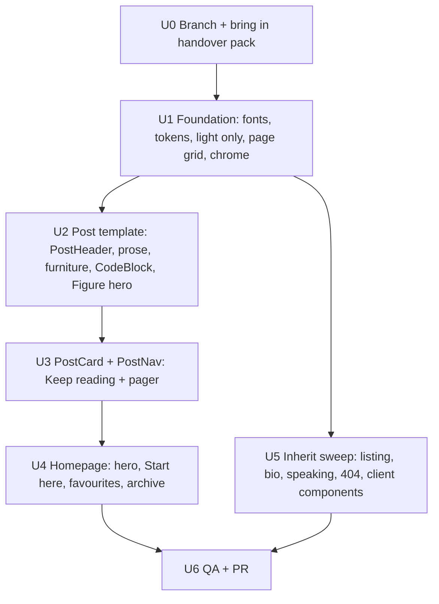

# Glasgow Civic Redesign - Plan

## Goal Capsule

- **Objective:** Reskin benstewart.ai's **homepage, post pages and site chrome** to the approved Glasgow Civic design. The look is a white page with a sturdy grotesk, Saltire blue as the one accent, sandstone surfaces, wayfinding numerals and huge whitespace. The site becomes **light theme only**.
- **Authority:**
  - `docs/design/glasgow-civic/DESIGN.md` is the spec and wins on any value it states.
  - `docs/design/glasgow-civic/reference/home.html` and `reference/post.html` are the approved prototypes. Their CSS is the source of truth for anything the spec doesn't state.
  - This plan governs scope and behaviour.
- **Stop conditions:**
  - Work lands on branch `feat/glasgow-civic` with a PR and a Vercel preview for Ben's sign-off. **Never merge to main.**
  - Stop and surface (don't improvise) if a change would alter SEO output (metadata, JSON-LD, sitemap, RSS, canonicals).
  - Stop and surface if a design value can't be met within the stack's constraints.
  - Stop and surface if a decision would add copy that doesn't already exist.
- **Execution profile:** Serial units with a build gate after each. Smoke-first verification: build, validate-posts, tests, then a visual comparison against the reference HTML at five widths, then axe-core.

---

## Product Contract

### Summary

Replace the July 2026 "editorial" skin (Petrona and Outfit, oxblood accent, light and dark themes) with Glasgow Civic.

This pass covers:

- The masthead and footer on every page.
- A rebuilt homepage: hero, a "Start here" sandstone arch with numbered posts, favourite-post cards, and an archive directory board.
- The full post template: centred header, an optional arched hero image, a 640px grotesk reading column, restyled MDX furniture, a code block with a Copy button, a sandstone TL;DR, "Keep reading" cards and a newer/older pager.

Every other page inherits the new tokens and fonts through a mechanical sweep, with no bespoke redesign.

### Problem Frame

Ben finds the current site basic and dark. Dark is partly because the site follows macOS dark mode. He chose a direction modelled on the restraint of the 2026 america.gov redesign, rooted in Glasgow, and approved two static prototypes. The design decisions are made. This plan turns them into the live Next.js template without disturbing content, SEO or the post-authoring workflow in `CLAUDE.md`.

### Requirements

**Foundation**

- R1. Tokens, fonts and type follow DESIGN.md sections 3.1 to 3.5.
  - Existing token names are kept (`paper`, `raise`, `ink`, `muted`, `faint`, `hair`, `accent`) with new values.
  - New tokens are added: `accent-deep`, `blond`, `blond-line`, `red`.
  - Fonts: Schibsted Grotesk (sans), Source Serif 4 italic only (serif), IBM Plex Mono (mono).
- R2. **Light theme only.**
  - Every `prefers-color-scheme: dark` and `[data-theme='dark']` rule, the dark `--sh-*` values and the dark-mode image dimming are removed.
  - `color-scheme: light` is declared in CSS and in the `viewport` export.
- R3. The masthead (wordmark and blue nav pill), footer (wordmark, "Glasgow", outlined link pills), skip link, focus ring and selection colour match DESIGN.md 4.1 on every route.

**Homepage**

- R4. `/` matches `reference/home.html`:
  - The hero: name with the kerning fix, caption and intro.
  - "Start here": the blond arch and the numbered list.
  - "Some of my favourite writing": three cards and the "View all posts" pill.
  - "Archive": a directory board of every post not featured above, grouped by year. Its "N more posts, YYYY to YYYY" line is computed from the data.
- R5. The homepage stays editable in `app/page.mdx`. The intro copy lives there as MDX, and the featured slug lists are defined there once and reused to exclude posts from the archive.

**Post page**

- R6. Every post renders in the Glasgow Civic post template:
  - `PostHeader`: breadcrumb pill, centred title, serif-italic standfirst, sentence-case meta line.
  - A 640px reading column with the element styles in DESIGN.md 4.3.
  - A `Figure` `hero` variant: arched frame, natural ratio, collapses if the image fails.
- R7. Existing MDX furniture is restyled so every post on the branch renders correctly **without per-post edits**: `PullQuote`, `KeyPoint`, `Callout`, `TLDR`, `Scenario`, `Collapsible`, `Divider`, `hr`, `blockquote`, `Table`, `Lede`, `Figure`, markdown `img`, inline code and code blocks. The only content edit is the pilot hero prop (U2).
- R8. Fenced code blocks render with a Copy button that copies the block's exact text. The button is a progressive enhancement: hidden until JS runs, with a live-region announcement. The block scrolls inside itself, never the page.
- R9. `PostNav` renders hand-picked related posts as "Keep reading" cards (title, subtitle, meta), then a newer/older pager.

**Integrity**

- R10. SEO behaviour is unchanged. Metadata exports, `PostSchema` and JSON-LD, sitemap, RSS and canonical URLs produce output identical to main's, ignoring generation-time fields. `npm run validate-posts` stays green.
- R11. Accessibility:
  - WCAG 2.2 AA contrast. There is no `faint` text on `blond`.
  - Visible focus on everything interactive, landmarks, one `h1` per page, `role="list"` on unstyled lists.
  - axe-core reports 0 violations on `/` and the pilot post at 1440px and 390px.
  - No horizontal page scroll from 360px to 1600px.
- R12. **No new copy** beyond the allow-list in DESIGN.md 2:
  - Visible labels: "Start here", "Archive", "Keep reading", "Newer", "Older", "Copy", "Copied", "TL;DR" and "posts" (breadcrumb).
  - Generated strings: "Undated", "N more posts, YYYY to YYYY" ("1 more post"; "YYYY" alone if there's only one year), "N min read" and "N min".
  - Accessible names: "Code sample", "Primary", "Footer" and "Post navigation".
  - No em dashes in any UI string the branch adds. Post MDX content is excluded from that sweep and is not edited.
  - UK English. Nav and footer labels stay lowercase.

### Scope Boundaries

**Deferred to follow-up work**

- Bespoke Glasgow Civic designs for `/posts`, `/bio` (`Timeline`, `Event`), `/speaking` and the 404 page. This pass only makes them inherit cleanly (U5).
- Backfilling real dates for the 11 Substack-imported posts sharing 2023-09-18. Until then they cluster under 2023 in the archive directory.
- Removing `app/demo/magazine` and `framer-motion`, and the leftover `"delete"` script (still deferred from July).
- Heading anchor links (still blocked by `experimental.mdxRs`).

**Outside this work**

- No content edits to posts, except replacing `width="420px"` with `hero` on one `Figure` in `multi-agent-ai-strategy` (the pilot).
- No slug, URL or information-architecture changes. No changes to `lib/mdx-parsing.mjs` or the validator's rules.
- No dark mode, no theme toggle. This deliberately reverses July's KTD2, by Ben's decision on 2 Oct 2026.

### Open Decisions for Ben

The defaults apply unless Ben says otherwise before U2 starts.

- **D1. Pilot post content.**
  - **Default:** no change beyond the `hero` prop. The hero renders after the post's opening italic line, and the standfirst is the short subtitle.
  - **Alternative**, if Ben wants the page to match the prototype exactly:
    - Set the `subtitle` in `multi-agent-ai-strategy`'s metadata to the long line "How I use AI to stress-test my thinking before it reaches a room full of people who won't push back hard enough."
    - Delete the italic paragraph at the top of the body.
    - Move the `<Figure … hero />` to directly after `<FAQJsonLd>`.
  - `subtitle` doesn't feed RSS, the sitemap or JSON-LD, so R10 holds either way. It does show in `/posts` and on cards.

---

## Planning Contract

### Key Technical Decisions

- **KTD1. Fonts via `next/font/google`, replacing Outfit and Petrona.**
  - `Schibsted_Grotesk({ subsets: ['latin'], weight: 'variable', style: ['normal', 'italic'], variable: '--font-schibsted' })`
  - `Source_Serif_4({ subsets: ['latin'], weight: '400', style: ['italic'], variable: '--font-source-serif' })`
  - `IBM_Plex_Mono({ subsets: ['latin'], weight: '400', variable: '--font-plex-mono' })`
  - Map them in `@theme`: `--font-sans`, `--font-serif` and `--font-mono`, each with the fallback stacks in DESIGN.md 3.2.
  - All three families were checked against the repo's `next/font` Google data.
- **KTD2. Serif means italic.**
  - Source Serif 4 is loaded italic only. Every `font-serif` usage in the repo either becomes `font-sans` or gains `italic`, following the allow-list in DESIGN.md 3.2.
  - Arbitrary weights (`font-[430|500|560|620]`) snap to 400, 500 or 700.
- **KTD3. Keep token names, change values.**
  - Tailwind utilities across the codebase (`text-ink`, `bg-raise`, `border-hair` and so on) keep working.
  - Semantic shift to watch: prose body copy is now `muted` (grey). Headings and `strong` are `ink`.
- **KTD4. A breakout grid on `<main>`.** Post MDX renders its blocks as direct children of `<main>`, and we don't want to wrap every post. So `<main>` becomes a named-line grid. Every child sits in the 640px `content` column by default, and components opt out with `.col-wide` (960px) or `.col-full` (the 1312px container). Add to `app/globals.css`:

  ```css
  @layer components {
    .site-container {                                  /* masthead, footer, every .col-full section */
      width: 100%;
      max-width: calc(1312px + 2 * var(--gutter));
      margin-inline: auto;
      padding-inline: var(--gutter);
    }
    .page-grid {
      display: grid;
      grid-template-columns:
        [full-start] minmax(var(--gutter), 1fr)
        [wide-start] minmax(0, 160px)
        [content-start] min(var(--measure), 100% - 2 * var(--gutter))
        [content-end] minmax(0, 160px)
        [wide-end] minmax(var(--gutter), 1fr)
        [full-end];
    }
    .page-grid > * { grid-column: content; min-width: 0; }
    /* prose rhythm: skip the first block after scripts, the post header and the hero; components override */
    .page-grid > :where(:not(script, .post-head, .hero-fig) + *) { margin-top: 1.1em; }
    .page-grid > .col-wide { grid-column: wide; }
    .page-grid > .col-full {
      grid-column: full;
      width: 100%;
      max-width: calc(1312px + 2 * var(--gutter));
      margin-inline: auto;
      padding-inline: var(--gutter);
    }
  }
  ```

  - **Layering matters.** These rules must live in `@layer components`, as shown. In Tailwind v4, unlayered CSS beats layered utilities **regardless of specificity**. If these rules were unlayered, they would silently override `mt-*` and other utilities on every child of `<main>`.
  - The same applies to any new custom CSS in `globals.css` that targets elements which also carry Tailwind utilities. Put it in `@layer components`. (Avoid naming anything `.container`: Tailwind has a utility of that name.)
  - Remove `space-y-6` and the `max-w-[75ch]` wrapper from `<main>`.
  - Grid items' margins don't collapse, so components use `margin-top` only.
  - Post header and hero spacing, without double-counting:
    - `.post-head` (the class on `PostHeader`'s root) gets `margin-bottom: clamp(64px, 7vw, 104px)`.
    - The hero `.hero-fig` gets `margin-top: clamp(48px, 4.5vw, 64px)` and `margin-bottom: clamp(64px, 7vw, 104px)`.
    - When a hero directly follows the header, the header's bottom margin is dropped. `PostSchema` and `FAQJsonLd` render `<script>` siblings between them, so the selector must skip scripts: `.post-head:has(+ .hero-fig, + script + .hero-fig, + script + script + .hero-fig) { margin-bottom: 0 }`.
  - Hidden `<script>` children (`PostSchema`, `FAQJsonLd`) take up no space. The rhythm rule above ignores them.
  - Pages that aren't redesigned land in the 640px column. That's acceptable for inherit-only pages.
- **KTD5. The homepage stays MDX, composed of server components.**
  - The new components live in `app/components/home/`: `HomeHero` (its children are the intro paragraphs), `StartHere`, `Favourites` and `ArchiveDirectory`. Each one reads `getAllPosts()`, like `PostList` does.
  - `app/page.mdx` exports the slug arrays once:

    ```mdx
    export const startHere = ["sustainable", "i-built-this-blog-with-claude-code", "multi-agent-ai-strategy"];
    export const favourites = ["ai-made-writing-free", "the-three-pound-question", "ralph-isnt-the-point"];
    ```

    and passes `exclude={[...startHere, ...favourites]}` to `ArchiveDirectory`.
  - The caption text goes in as `HomeHero` props written in the MDX, so it stays editable: `tagline="Engineer turned leader."` and `place="Glasgow"`. **Don't name a prop `role`**: it is too easy to spread onto the DOM as an invalid ARIA role.
  - In JSX, the two name spans need an explicit space between them (`<span>Ben</span>{' '}<span>Stewa…</span>`). Otherwise the h1's accessible text becomes "BenStewart".
- **KTD6. Year grouping is a pure function in `lib/posts.ts`.**
  - Signature: `groupPostsByYear(posts): { year: string; posts: Post[] }[]`. Years run newest first; a null date goes in a final "Undated" group.
  - Unit-tested in `lib/posts.test.ts`. It's pure, so it needs no temp dir.
  - `ArchiveDirectory` marks a year "wide" when it has more than 6 posts.
- **KTD7. `PostHeader` keeps its API** (`title` and `slug` props). It is restyled only, plus the breadcrumb. The validator's PostHeader rules are untouched.
- **KTD8. `Figure` gains `hero?: boolean`.**
  - Hero renders a `<figure className="hero-fig col-wide">` with the arched frame and natural ratio, and no visible caption (alt is still required).
  - The `img` inside is a new **client** component, `app/components/HeroImage.tsx` (`'use client'`). `mdx-components.tsx` is a server module and **cannot pass `onError`**, because React rejects event handlers across the server/client boundary.
  - `HeroImage` detects failure two ways: its `onError` handler, and a `useEffect` check of `ref.current.complete && ref.current.naturalWidth === 0`. The second covers errors that fire before hydration.
  - On failure it adds `is-empty` to the frame, and CSS hides the figure (`.hero-fig:has(.is-empty) { display: none }`).
  - Keep the prototype's `.frame img::after` paper overlay, so a broken image never shows an icon even without JS.
  - Non-hero `Figure` and the markdown `img` mapping get the default treatment from DESIGN.md 4.3.
- **KTD9. Code blocks: highlighting moves into a `pre` mapping, plus a client `CodeBlock`.**
  - **Today's problem:** the `code` mapping runs sugar-high's `highlight()` on every `<code>`, inline code included. Unlabelled fences (like the pilot's prompt, which is English prose) therefore get coloured as JavaScript: `do` and `if` turn blue, and text after an apostrophe turns string-green. The approved design shows plain ink for unlabelled fences.
  - **New `pre` mapping** in `mdx-components.tsx` (server):
    - Read the fence source from `children.props.children` (a string) and the language from `children.props.className`.
    - If the className starts with `language-`, render `<code className={className} dangerouslySetInnerHTML={{ __html: highlight(src) }} />`. Otherwise render plain `<code>{src}</code>`.
    - Pass the result to `CodeBlock`.
  - The **`code` mapping** becomes a plain `<code {...props} />`, used for inline code only. Its styling comes from CSS.
  - **New file `app/components/CodeBlock.tsx`** (`'use client'`). DOM:

    ```html
    <div class="code-block">            <!-- grid child: bleed, border, radius, position: relative -->
      <button type="button" class="copy" hidden>Copy</button>
      <span role="status" class="sr-only"></span>
      <pre ref={preRef} role="region" aria-label="Code sample" tabIndex={0}>{code}</pre>
    </div>
    ```

  - **Copy behaviour:**
    - The button sits **outside** the `pre`, so the copied text never includes "Copy" and the button doesn't scroll with the code.
    - The button reads `preRef.current.textContent` at click time.
    - `useEffect` un-hides the button and adds `has-copy` to the wrapper. The 60px top padding at 960px and below keys off `.code-block.has-copy pre`.
    - After copying, set the status span's text to "Copied" for 2 seconds.
    - If `navigator.clipboard?.writeText` is unavailable, the button stays hidden. A rejected write is caught and announces nothing. R12 allows no error string.
  - Remove the CSS that hides `pre` scrollbars.
- **KTD10. A shared `PostCard`.** New file `app/components/PostCard.tsx`, a server-safe presentational component that takes a `Post` and renders title, subtitle excerpt and meta with a whole-card link. It's used by `Favourites` (homepage) and by `RelatedPosts`/`PostNav` ("Keep reading").
  - `PostNav` passes full `Post` objects to `RelatedPosts`.
  - No post uses `<RelatedPosts>` directly (checked), but keep its `{ slug, title }` prop shape accepted for safety, with the other fields optional.
- **KTD11. One link treatment.** Update `textLinkClass` in `app/components/TextLink.tsx` to the Glasgow Civic link: ink text, a 2px accent underline, offset 0.22em, accent text on hover. Every in-copy link inherits it. Keep the literal `underline` utility in the class string, because `mdx-components.test.tsx` asserts it.
- **KTD12. Branch from `origin/main`, never from Ben's working copy.**
  - Ben's checkout is on `draft/levels-describe-tasks`, with uncommitted files.
  - Create a separate worktree or clone on a new branch `feat/glasgow-civic` from `origin/main`.
  - **This handover pack sits untracked in Ben's working copy** at `docs/design/glasgow-civic/` and `docs/plans/2026-10-02-001-feat-glasgow-civic-redesign-plan.md`. A worktree from `origin/main` won't contain it, so copy both into the branch as the first commit.
  - If the files aren't there, stop and ask Ben for the handover bundle.
- **KTD13. Prose CSS is scoped by class, never by bare element.**
  - Homepage lists (StartHere's `<ol>`, card and archive `<ul>`s) also live inside `<main>`. So hanging numerals, bullets and the rhythm must target classes that the MDX mappings emit, for example `ol` gets `className="prose-ol"`, `ul` gets `"prose-ul"` and `blockquote` gets `"prose-quote"`.
  - Never use `main ol` or `.page-grid ol`.
  - **Nested paragraphs:** when MDX wraps a component's children in paragraphs, the `p` mapping's own size, colour and weight win over anything inherited. Each container that sets its own body type must style its descendant paragraphs too, as the current `blockquote` mapping does with `[&>p]:`. For example:
    - KeyPoint: `[&_p]:text-[1.3125rem] [&_p]:font-medium [&_p]:text-ink`
    - TLDR: `[&_p]:text-[1.125rem] [&_p]:text-ink`
    - PullQuote: pull-quote scale
    - Scenario: serif italic
    - HomeHero intro: intro scale
  - Inline children render inside the container directly (for example, `waist` uses `<KeyPoint>Why Am I Still Talking</KeyPoint>`). Both cases must look the same.
- **KTD14. Breakpoints are inclusive custom variants.**
  - Tailwind v4's `max-[960px]:` compiles to `width < 960px`, but the design's breakpoints are inclusive `max-width`. They disagree at exactly 1080, 960, 760 and 380px.
  - Define these in `globals.css`, largest first so the narrower ones win:

    ```css
    @custom-variant tab   (@media (max-width: 1080px));
    @custom-variant cards (@media (max-width: 960px));
    @custom-variant mob   (@media (max-width: 760px));
    @custom-variant tight (@media (max-width: 380px));
    ```

  - Use only these for layout changes. Don't use `sm`, `md`, `lg` or `max-[…]`.
- **KTD15. No unlayered element CSS survives.**
  - These existing rules in `globals.css` are unlayered and so beat every Tailwind utility: `pre`, `pre::-webkit-scrollbar`, `code`, `pre code`, `pre code span { font-weight: 500 }`, `table`, `h1 to h4 { text-wrap }`, `::selection` and `:focus-visible`.
  - Move each one into `@layer base`, rewritten to the new values, or delete it. Delete `pre code span { font-weight: 500 }` outright: Plex Mono is loaded at 400, so it would synthesise bold.
  - The `:focus-visible` rule's `border-radius` must not square off pill buttons. Set the focus radius in `@layer base`, so `rounded-full` utilities win.
  - Afterwards nothing unlayered may target an element that also carries utilities. The only exception is `.lede > p::first-letter`, which no utility can reach; keep it unlayered.

### High-Level Technical Design



**Token flow:**

- `app/globals.css` (`:root` values plus the `@theme` mapping) owns every colour, font and spacing token.
- `app/layout.tsx` wires the fonts and chrome.
- `mdx-components.tsx`, `app/components/*` and the page files consume tokens only. There are no raw hex values or palette classes outside `globals.css`.
- Spacing tokens `--gutter`, `--section`, `--measure` and `--hang` live in `:root`.

**Execution notes:** run the units in order. U2 and U4 both edit `globals.css` and `mdx-components.tsx`, so don't parallelise them. U5 can run any time after U1. Each unit ends with `npm run build` and `npm run validate-posts` before the next starts. **Never run `next build` while `next dev` is running** (`docs/solutions/workflow-issues/next-build-during-dev-corrupts-dot-next.md`).

---

## Implementation Units

### U0. Branch and handover

- **Goal:** A clean branch from main that carries the design pack.
- **Files:** `docs/design/glasgow-civic/**`, `docs/plans/2026-10-02-001-feat-glasgow-civic-redesign-plan.md`.
- **Approach:**
  1. `git fetch origin`.
  2. Create a worktree or clone on a new branch, `feat/glasgow-civic`, from `origin/main`.
  3. Copy the handover files in from Ben's working copy.
  4. Commit `docs: Glasgow Civic design handover`.
  5. Run `npm install` if `node_modules` is absent.
- **Verification:** `git log -1` shows the docs commit, and `npm run build` passes on the untouched code. That is the baseline.

### U1. Foundation: fonts, tokens, light only, page grid, chrome

- **Goal:** Every route renders on the new tokens, fonts and chrome, and dark mode is gone.
- **Requirements:** R1, R2, R3, R11, R12.
- **Files:** `app/layout.tsx`, `app/globals.css`, `app/viewport.ts`, `app/components/TextLink.tsx`, `app/components/icons.tsx` (new; the `ArrowIcon` from the prototype, `aria-hidden`).
- **Approach:**
  1. **Fonts:** apply KTD1 and remove the Outfit and Petrona imports and variables.
  2. **`globals.css` colours:**
     - Replace the `:root` values with DESIGN.md 3.1 and add the four new tokens to `:root` and `@theme`.
     - Delete every dark-mode block: the `@media (prefers-color-scheme: dark)` rules, `[data-theme='dark']`, the dark `pre` overrides and the image `filter`.
     - Add `color-scheme: light`.
     - Set the light `--sh-*` values from DESIGN.md 3.1.
  3. **`globals.css` base styles:**
     - Body base styles (DESIGN.md 3.3, "Base body"). Remove `tracking-tight text-lg` from `<body>`.
     - `::selection` (white on accent) and `:focus-visible` (DESIGN.md 3.5), both in `@layer base` (KTD15).
     - Add the `.site-container` and `.page-grid` rules (KTD4), the spacing tokens and the custom breakpoint variants (KTD14).
     - Apply KTD15 to every existing element rule.
     - Remove the stray `hr { color: var(--color-gray-200) }`.
     - **Safe areas:** delete `.safe-top`, `.safe-bottom` and their `@supports` block. Instead:
       - Masthead: `padding-top: calc(32px + env(safe-area-inset-top))` (20px base on mobile).
       - Footer: `padding-bottom: calc(64px + env(safe-area-inset-bottom))`.
       - Gutter: `--gutter: max(clamp(20px, 4.45vw, 64px), env(safe-area-inset-left), env(safe-area-inset-right))`.
       - `viewportFit: 'cover'` stays.
  4. **`viewport.ts`:** add `colorScheme: 'light'` and `themeColor: '#FDFCFA'`.
  5. **`layout.tsx` chrome:**
     - Replace the current wrapper `<div className="min-h-screen flex flex-col justify-between p-8 … safe-top safe-bottom">` with `<div className="flex min-h-screen flex-col bg-paper text-ink">`. Its `p-8` would eat 32px of every gutter and break the 360px masthead.
     - Rebuild `Masthead` and `Footer` per DESIGN.md 4.1, keeping the same link arrays and external-link behaviour. Wrap each in `.site-container` (KTD4).
     - `<main id="main" className="page-grid flex-1">` gets no margin utilities. Remove `mt-4 md:mt-16`, `space-y-6` and `max-w-[75ch]`.
     - Keep the skip link, restyled as an ink pill.
     - **Keep the `metadata` export byte-for-byte.**
  6. **`TextLink.tsx`:** apply the KTD11 link treatment.
- **Test scenarios:**
  - `/`, `/posts`, `/bio`, `/speaking` and an unknown route all render with the new masthead and footer, and their links resolve.
  - With emulated `prefers-color-scheme: dark` the page stays light.
  - At 360px the masthead stays on one row with no horizontal scroll, and the first Tab press reveals the skip link.
- **Verification:** `npm run build` and `npm run validate-posts` are green. Screenshot the masthead and footer against `reference/screens/home-desktop.jpg` and `home-mobile.jpg`.

### U2. Post template: header, prose, furniture, code, hero figure

- **Goal:** Every post renders in the Glasgow Civic post template.
- **Requirements:** R6, R7, R8, R11, R12.
- **Files:**
  - `app/components/PostHeader.tsx`
  - `mdx-components.tsx`
  - `app/components/CodeBlock.tsx` (new, client)
  - `app/components/HeroImage.tsx` (new, client)
  - `app/globals.css` (prose helpers that need selectors Tailwind can't express, in `@layer components`: hanging list numerals, the pull-quote bar, code)
  - `app/posts/multi-agent-ai-strategy/page.mdx` (pilot: one prop)
- **Approach:**
  1. **`PostHeader`** (DESIGN.md 4.3, "Post header"):
     - Render as `<header className="post-head col-full">`, centred.
     - Breadcrumb pill to `/posts`, h1, then the standfirst from `post.subtitle` in serif italic.
     - Meta line `formatUkDate · N min read` in sentence case.
     - Same data resolution as today.
  2. **Element mappings** in `mdx-components.tsx`:
     - `p`, `h2`, `h3`, `h4`, `ol`, `ul` (with `role="list"`), `li`, `strong`, `em` (grotesk italic), `a` (via `textLinkClass`), `blockquote`, `hr`, `img`, `Table`.
     - Use the sizes and colours in DESIGN.md 3.3 and 4.3.
     - Put hanging marks in CSS: `ol > li::before` counters at `right: calc(100% + var(--hang))`, moving inside the column at 960px and below.
  3. **Furniture:** restyle `PullQuote`, `KeyPoint`, `Callout`, `TLDR` (`col-wide`), `Scenario`, `Collapsible`, `Divider` and `Lede` per DESIGN.md 4.3.
     - **No component may wrap `children` in a `<p>`.** Use `<div>` (see `docs/solutions/ui-bugs/mdx-component-p-wrapper-invalid-nesting.md`).
     - Keep every component's props and behaviour.
  4. **`Figure`:** add `hero` (KTD8); restyle the default.
     - Pilot: in `app/posts/multi-agent-ai-strategy/page.mdx`, change that post's single `Figure` from `width="420px"` to `hero`. Leave the alt and caption untouched. The image is 1536 × 1024.
     - Expect two differences from `reference/post.html`. In the real MDX, an italic paragraph (`*How I use AI to stress-test my thinking before it reaches a room full of people…*`) sits between the header and the `Figure`, so the hero renders below that line rather than directly under the header. The post's `subtitle` is also the short form. Both are expected unless Ben approves Open Decision D1. Don't edit them otherwise.
  5. **Code:** add the `pre` mapping and `CodeBlock` (KTD9).
     - Style inline `code` and the block per DESIGN.md 4.3: `raise` ground, `blond-line` border, 40px desktop bleed with negative margins, internal scroll, and 60px top padding at 960px and below so the Copy button never covers code.
- **The prototype simplifies the pilot. Build from the real MDX, not the prototype's markup:**
  - The prototype shows the "So What?" questions and the "What I've learned" items as ruled `.leadins` rows. In the MDX they are a `<Callout type="insight">` and bold-lead paragraphs.
  - It shows the closing italic paragraph as a serif `.coda`.
  - It flattens the KeyPoint and the other Callouts into plain paragraphs.
  - It shows the code block open. In the MDX it sits inside a closed `<Collapsible>`.
  - **Don't build `.leadins` or `.coda`.** Furniture follows DESIGN.md 4.3, and italic-only paragraphs stay grotesk italic.
- **Test scenarios:**
  - The pilot post `/posts/multi-agent-ai-strategy` matches `reference/post.html` and `screens/post-desktop.jpg` and `post-mobile.jpg` for chrome, header, hero, prose, the list with nested bullets, both pull quotes and the TL;DR. Callouts, the KeyPoint and the Collapsible are checked against DESIGN.md 4.3 instead.
  - Open the Collapsible, then click Copy on the pilot's code block. The clipboard must hold exactly the fenced text (Playwright with clipboard permissions; compare with the MDX source fence).
  - The pilot's unlabelled fence renders as plain ink, not syntax-coloured. A labelled fence (e.g. in `i-built-this-blog-with-claude-code`) is still highlighted.
  - With JS disabled the Copy button is absent and the code is intact.
  - At 390px the code block scrolls inside itself and `document.documentElement.scrollWidth === clientWidth`.
  - `waist` (heavy furniture), `ralph-isnt-the-point` (`Lede` and `Figure`), `ai-made-writing-free` (client components) and `i-built-this-blog-with-claude-code` (code) all render without layout breakage.
  - No custom component in `mdx-components.tsx` renders a `<p>` around `children`; only the `p` element mapping itself renders a `<p>`. The built HTML has no `<p>` nested in `<p>`: `grep -rEl '<p[^>]*>\s*<p' .next/server/app --include='*.html'` returns nothing.
  - `KeyPoint` looks identical with inline children (`waist`) and with block children (the pilot), per KTD13.
- **Verification:** build, validate-posts and tests are green, and the visual pass above is done.

### U3. PostCard and PostNav: Keep reading and pager

- **Goal:** The end of every post matches the reference.
- **Requirements:** R9, R11.
- **Files:** `app/components/PostCard.tsx` (new), `app/components/RelatedPosts.tsx`, `app/components/PostNav.tsx`.
- **Approach:**
  1. **`PostCard`** (KTD10): 2px ink top rule, title, excerpt, meta, a whole-card link via a `::after` overlay, and a focus ring on the overlay.
  2. **`RelatedPosts`:** a `col-full` section with the h2 "Keep reading" and a 3-up card grid (`grid-template-rows: subgrid` where supported), stacking at 960px and below.
  3. **`PostNav`:**
     - Pass full `Post` objects.
     - Render the pager as a `col-full` `nav aria-label="Post navigation"`, with two halves: Newer on the left, Older on the right with arrows.
     - Keep the existing newer/older derivation logic unchanged.
- **Test scenarios:**
  - The pilot shows its three related posts as cards (Ralph, A prompt to your leadership style, Sustainable Pace) and the pager shows "AI Made Writing Free..." as Newer and "The £3 Question" as Older.
  - The newest post (no Newer) and the oldest post (no Older) render a single half without layout breakage.
  - A post with no `related` prop renders the pager only.
- **Verification:** build and validate-posts are green, and the visual check against `screens/post-desktop.jpg` (bottom) and `post-mobile.jpg` passes.

### U4. Homepage

- **Goal:** `/` matches `reference/home.html`.
- **Requirements:** R4, R5, R11, R12.
- **Files:**
  - `app/page.mdx`
  - `app/components/home/HomeHero.tsx`, `StartHere.tsx`, `Favourites.tsx`, `ArchiveDirectory.tsx` (all new)
  - `lib/posts.ts` (`groupPostsByYear`) and `lib/posts.test.ts`
  - `mdx-components.tsx` (register the new components)
  - `app/globals.css` (anything Tailwind can't express cleanly, for example the arch radius or directory columns)
- **Approach:**
  1. **`HomeHero`** (`col-full`, DESIGN.md 4.2, "Hero"):
     - h1 with the **kerning span** and two word spans for mobile stacking.
     - Caption column (`tagline` and `place` props, per KTD5), and the intro children in the 12-column grid.
  2. **`StartHere`** (`col-full`): blond arch plus numbered list, from `slugs`. The arch heading and line are props or children taken from the existing MDX copy ("Start here", "Three posts that introduce what this blog is about.").
  3. **`Favourites`** (`col-full`): h2 from the existing copy, three `PostCard`s, and a "View all posts" primary pill linking to `/posts`.
  4. **`ArchiveDirectory`** (`col-full`): `exclude` slugs; group with `groupPostsByYear`; meta line "N more posts, YYYY to YYYY"; the directory board layout from DESIGN.md 4.2, including "wide" years with more than 6 posts.
     - If a wide year doesn't fit in the columns left on a row, it starts a new row, and the gap it leaves is acceptable.
     - **Don't use `grid-auto-flow: dense`.** It would reorder years.
  5. **Rewrite `app/page.mdx`:**
     - Exports (KTD5), `<HomeHero>` wrapping the three existing intro paragraphs verbatim, `<StartHere>`, `<Favourites>`, `<ArchiveDirectory>`.
     - Remove the old `# Ben Stewart` heading and `PostList` usage. `HomeHero` renders the h1.
- **Test scenarios:**
  - `groupPostsByYear` unit tests: newest year first, posts within a year keep index order, null dates go to "Undated", an empty input returns `[]`.
  - The archive lists exactly `allPosts.length - 6` posts with no duplicates of featured slugs, and the meta line count and year range match.
  - "Stewart" shows a visible gap between r and t at 1440px and 390px (zoomed screenshot).
  - At 1080px, 960px, 760px and 360px the layout steps match the prototype: arch and list side by side then stacked, cards 3-up then stacked, directory 3-column then 1-column with CSS columns.
- **Verification:** `npm test` (including the new tests), build and validate-posts are green, and a side-by-side screenshot comparison with `reference/home.html` passes at 1440, 1024, 768, 390 and 360.

### U5. Inherit sweep (no redesign)

- **Goal:** Pages outside this pass's design scope don't look broken on the new system.
- **Requirements:** R1, R2, R11.
- **Files:**
  - `app/components/PostList.tsx`, `app/posts/page.tsx`, `app/speaking/page.tsx`, `app/not-found.tsx`
  - `Timeline` and `Event` in `mdx-components.tsx`
  - `app/posts/ai-made-writing-free/CopyablePrompt.tsx`, `ReadCostCalculator.tsx`
- **Approach:**
  - Mechanical edits only:
    - `font-serif` becomes `font-sans`, except where the element is italic and on the allow-list in DESIGN.md 3.2.
    - Snap weights to 400, 500 or 700.
    - Drop uppercase tracked kickers in favour of sentence-case meta style.
    - Confirm nothing relies on removed dark-mode CSS.
  - No new layouts.
  - `app/demo/magazine` is untouched (deferred) but must still build.
- **Test scenarios:**
  - `/posts`, `/bio`, `/speaking` and the 404 page render legibly at 1440 and 390 with no serif-upright text, no overflow and visible focus.
  - `ai-made-writing-free`'s calculator and copyable prompt still work.
- **Verification:** build is green and the visual smoke pass is done.

### U6. QA, branch and PR

- **Goal:** Verified end to end and delivered for preview without touching main.
- **Requirements:** all, especially R10 and R11.
- **Files:** none new.
- **Approach:**
  1. **Full gate run:** `npm test`, `npm run validate-posts`, `npm run build` (dev server stopped).
  2. **Grep sweep on touched files:**
     - `prefers-color-scheme`, `data-theme`, `gray-`, `neutral-`, `#000`, `#fff` outside the permitted white-on-blue, and `font-\[` arbitrary weights.
     - `Outfit` and `Petrona`.
     - The em dash character in the `.tsx` and `.css` files that this branch changed, and in `app/page.mdx`. Post MDX is excluded.
  3. **SEO diff:** compare RSS and sitemap post entries and the JSON-LD on two posts against main's output, ignoring generation-time fields.
  4. **axe-core:** inject `axe.min.js` with Playwright on `/` and `/posts/multi-agent-ai-strategy` at 1440 and 390. Expect 0 violations.
  5. **Overflow sweep:** 360px to 1600px in 40px steps on `/` and the pilot post.
  6. **Update `CLAUDE.md`** so future posts don't drift:
     - **Tech Stack fonts:** Schibsted Grotesk, Source Serif 4 italic, IBM Plex Mono.
     - **Components table:** add the `Figure` `hero` prop, and update the `Callout` description.
     - **Style Notes:** 640px measure, light only (no dark mode), "serif means italic", the breakpoint variants and the link treatment.
     - **Leave the Tone of Voice Guide untouched.**
  7. **Push:**
     - `gh auth switch --user ibenstewart` (see `docs/solutions/workflow-issues/git-push-wrong-gh-account-System-20260322.md`).
     - Push `feat/glasgow-civic` and open a PR titled "Glasgow Civic redesign: homepage, post template, chrome (light only)".
     - The PR body links DESIGN.md and includes before/after screenshots.
- **Verification:** all gates are green, the PR is open with the Vercel preview URL reported to Ben, and main is untouched.

---

## Verification Contract

| Gate | Command / method | Applies to |
|---|---|---|
| Post format and SEO invariants | `npm run validate-posts` | every unit |
| Type and build integrity | `npm run build` (dev server stopped) | every unit |
| Unit specs | `npm test` (vitest; adds `groupPostsByYear` tests) | U4, U6 |
| Visual match | Playwright screenshots of the dev server against `docs/design/glasgow-civic/reference/*.html` at 1440, 1024, 768, 390 and 360 | U1 to U4 |
| Behaviour | Copy-to-clipboard equality, JS-off render, image-failure collapse, no horizontal scroll | U2, U3, U6 |
| Accessibility | axe-core: 0 violations on `/` and the pilot post at 1440 and 390; keyboard tab-through | U6 |
| SEO unchanged | RSS, sitemap and JSON-LD compared with main | U6 |
| Ship gate | PR plus Vercel preview; Ben approves before merge | U6 |

## Definition of Done

- U0 to U6 complete, and every gate in the Verification Contract is green.
- `/` and `/posts/multi-agent-ai-strategy` match the reference prototypes at desktop and mobile. Any deliberate deviation is listed in the PR body with a reason.
- Every post on the branch renders in the new template with no per-post edits beyond the pilot `hero` prop.
- There is no dark-mode code, no Outfit or Petrona, no upright serif and no arbitrary font weights in touched files.
- SEO outputs are verified unchanged.
- Branch `feat/glasgow-civic` is pushed with an open PR and Vercel preview link. Main is untouched, and Ben's `draft/levels-describe-tasks` checkout and its uncommitted files are untouched.

## Sources & Research

- Approved prototypes and screenshots: `docs/design/glasgow-civic/reference/`. They were built and reviewed on 2 Oct 2026.
  - Copy fidelity was checked against the live post.
  - The 65-line code block copies byte-exact.
  - axe-core reported 0 violations at 1440 and 390.
  - No overflow from 360 to 1600.
- `docs/design/glasgow-civic/DESIGN.md`: tokens with measured contrast ratios, the type scale, and component specs.
- `docs/plans/2026-07-30-001-feat-editorial-redesign-plan.md`: the previous reskin. It established `PostHeader`, `lib/posts.ts` `readingMinutes`, validator rules and the token architecture this plan reuses.
- `docs/solutions/ui-bugs/mdx-component-p-wrapper-invalid-nesting.md`: no `<p>` wrappers around MDX children.
- `docs/solutions/workflow-issues/next-build-during-dev-corrupts-dot-next.md`: never build while dev is running.
- `docs/solutions/workflow-issues/git-push-wrong-gh-account-System-20260322.md`: push as `ibenstewart`.
- Repo inventory (2 Oct 2026, read-only). It was taken from Ben's working copy on `draft/levels-describe-tasks`, which has one extra draft post (`what-level-does-this-task-deserve`) not yet on main. Counts on `origin/main` may differ slightly (expect Figure 2, Lede 1, Table 0). If no post on the branch uses `Table`, verify it with a local MDX fixture that isn't committed.
  - Furniture usage across posts: Callout 29, KeyPoint 25, TLDR 20, PullQuote 8, Scenario 4, Figure 3, Lede 2, Collapsible 1, Table 1, Timeline 1 (bio).
  - Two posts use markdown blockquotes, and eight posts use h3.
  - No post uses `<RelatedPosts>` directly.
  - Every post ends with `<PostNav>`.
  - `PostList` is used only by `app/posts/page.tsx` and the homepage.
  - The pilot hero image is `public/images/posts/thinking-engine-0.png`, 1536 × 1024.
  - Schibsted Grotesk, Source Serif 4 and IBM Plex Mono are present in the installed `next/font` Google font data.
